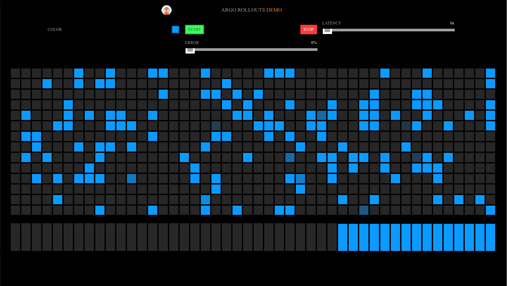
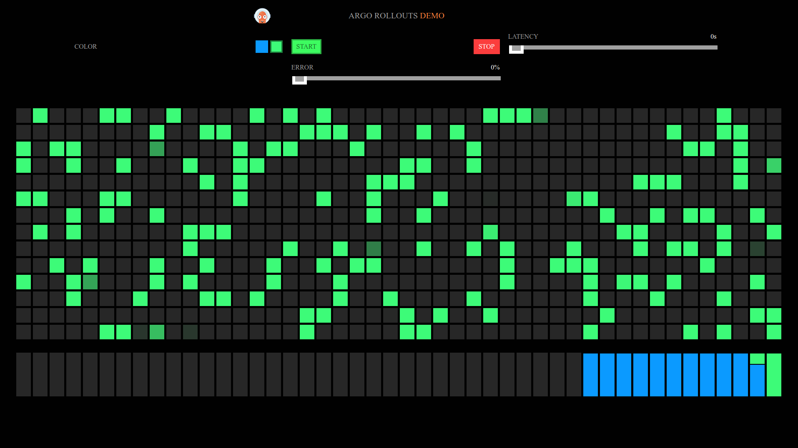

# Rollouts: Blue-Green Deployment


After deployment, `kubectl get ingress` output example:
```
NAME             CLASS   HOSTS          ADDRESS                PORTS   AGE
demo-bluegreen   nginx   <YOUR-URL>     <YOUR-EXTERNAL-IP>     80      4m1s
```
`kubectl get pods` output example:
```
NAME                              READY   STATUS    RESTARTS   AGE
demo-bluegreen-545666f85f-4v7t5   1/1     Running   0          4m50s
demo-bluegreen-545666f85f-bhkpd   1/1     Running   0          4m50s
demo-bluegreen-545666f85f-m7t5f   1/1     Running   0          4m50s
```
`kubectl get svc` output example:
```
NAME             TYPE        CLUSTER-IP      EXTERNAL-IP   PORT(S)        AGE
demo-bluegreen   NodePort    10.102.146.68   <none>        80:31768/TCP   9m17s
kubernetes       ClusterIP   10.96.0.1       <none>        443/TCP        44h
```

## The play

```
sed -i 's/demo:blue/demo:green/g' bluegreen_rollout.yaml
```
then:
```
kubectl apply -f bluegreen_rollout.yaml

rollout.argoproj.io/demo-bluegreen configured
service/demo-bluegreen unchanged
```

[](img/01.bg.png)

[](img/02.bg.png)